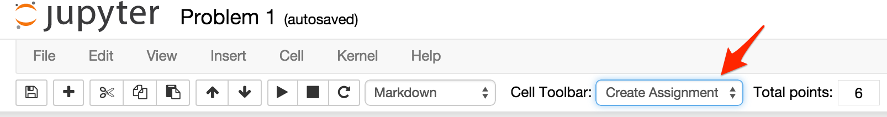
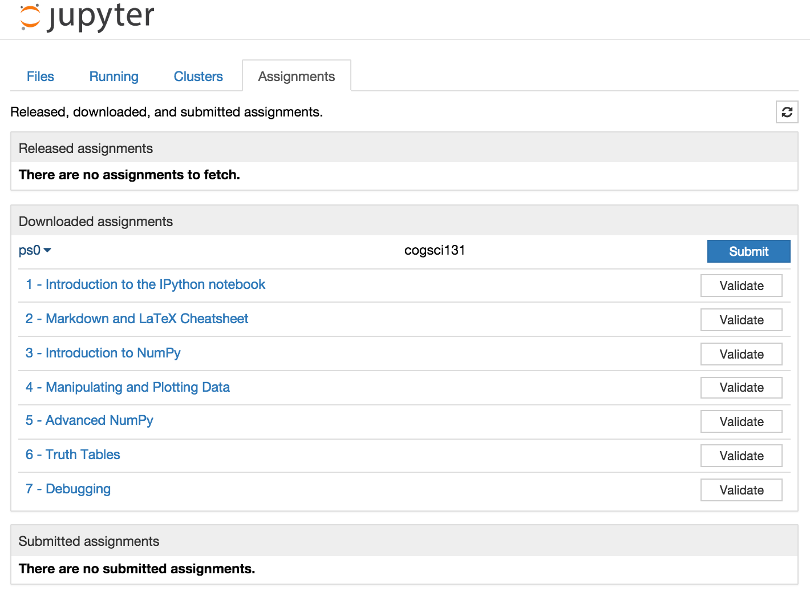

# nbgrader

A system for assigning and grading Jupyter notebooks.

[Documentation can be found on Read the Docs.](http://nbgrader.readthedocs.org)

## Visual highlights of nbgrader

### Instructor toolbar extension for Jupyter notebooks
The nbgrader toolbar extension for Jupyter notebooks guides the instructor through
assignment and grading tasks using the familiar Jupyter notebook interface.

### Student toolbar extension for Jupyter notebooks
Using the toolbar extension, students may conveniently view, fetch, submit, and validate their assignments.

### Using formgrader
TODO Example demonstrating formgrader is coming soon.

### The command line tools of nbgrader
Command lines tools offer an efficient way for the instructor to generate, assign,
release, collect, and grade notebooks.

* `nbgrader assign`: create a student version of a notebook
* `nbgrader release`: release a notebook to students
* `nbgrader collect`: collect students' submissions
* `nbgrader autograde`: autograde students' submissions
* `nbgrader formgrade`: launch the formgrader

## Installation

### The nbgrader system and command line tools
You may install the current version of nbgrader which includes the grading
system and command line tools:

    pip install nbgrader

### The nbgrader toolbar extension for Jupyter notebook
You may then install the nbgrader toolbar extension for
Jupyter notebook. This will install both the "create assignment" and
"assignment list" extensions for the notebook:

    nbgrader extension install

To use the toolbar extension as either an instructor or a student, activate the
extension with:

    nbgrader extension activate

If you want to install the extension for only your user environment and not
systemwide, use `nbgrader extension install --user`.
If you don't want to have to reinstall the extension when nbgrader is updated,
use `nbgrader extension install --symlink`.

To get help and see all the options you can pass while installing or activating
the nbgrader notebook extension, use:

    nbgrader extension install --help-all
    nbgrader extension activate --help-all

## Contributing

Please see the [contributing guidelines and documentation](CONTRIBUTING.md).

If you want to develop features for nbgrader, please follow the
[development installation instructions](CONTRIBUTING.md#development-installation).
