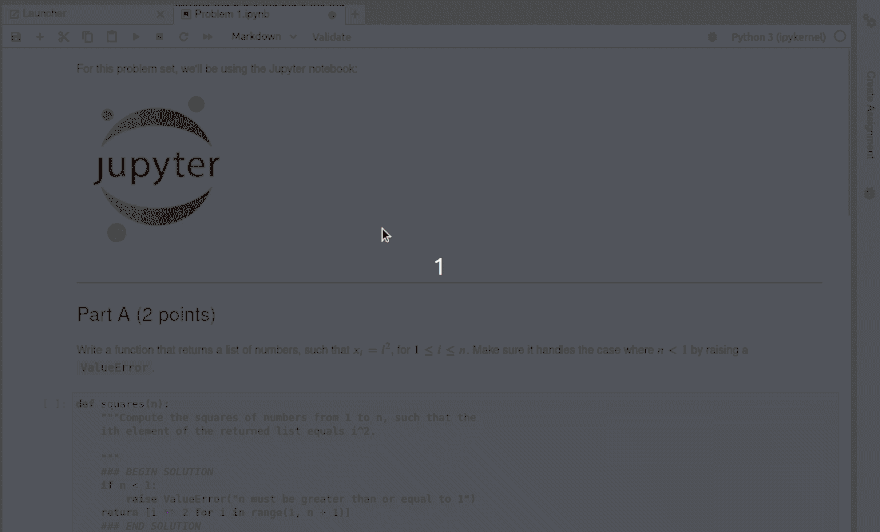

# nbgrader

Linux:   
Windows:   
Forum:   
Coverage:   
Cite: 

A system for assigning and grading Jupyter notebooks.

[Documentation can be found on Read the Docs.](https://nbgrader.readthedocs.io/en/stable/)

## Highlights of nbgrader

### Instructor toolbar extension for Jupyter notebooks
The nbgrader toolbar extension for Jupyter notebooks guides the instructor through
assignment and grading tasks using the familiar Jupyter notebook interface.

### Instructor "formgrader" extension for Jupyter notebooks

The formgrader extension for the Jupyter notebook allows instructors to use
the core functionality of nbgrader---generating the student version of an
assignment, releasing assignments to students, collecting assignments,
autograding submissions, and manually grading submissions.

### Student assignment list extension for Jupyter notebooks
Using the assignment list extension, students may conveniently view, fetch,
submit, and validate their assignments.

### The command line tools of nbgrader

[Command line tools](https://nbgrader.readthedocs.io/en/latest/command_line_tools/index.html)
offer an efficient way for the instructor to generate, assign, release, collect,
and grade notebooks.

### SciPy 2017 overview talk (click to view on YouTube)

## Installation

For detailed instructions on installing nbgrader and the nbgrader extensions
for Jupyter notebook, please see [Installation](https://nbgrader.readthedocs.io/en/latest/user_guide/installation.html)
section in the User Guide.

## Contributing
Please see the [contributing guidelines and documentation](https://nbgrader.readthedocs.io/en/latest/contributor_guide/overview.html).

If you want to develop features for nbgrader, please follow the
[development installation instructions](https://nbgrader.readthedocs.io/en/latest/contributor_guide/installation_developer.html).
