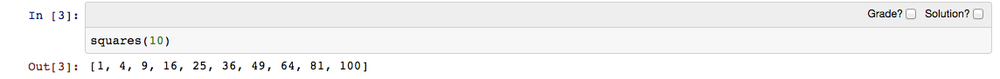
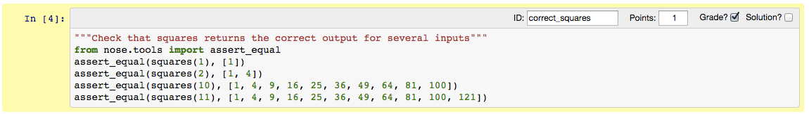
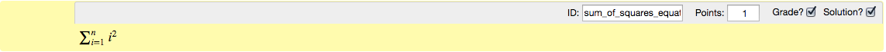
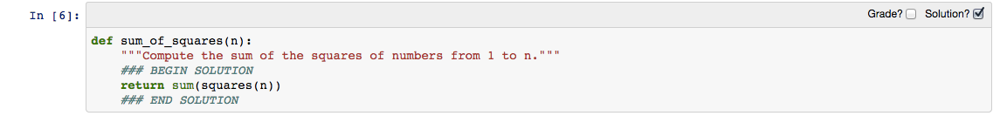

Developing assignments with the assignment toolbar
==================================================

nbgrader includes an extension to the notebook interface that allows
cells to be marked for grading.

To install the toolbar, make sure you have installed nbgrader (follow
the instructions `here <index.rst>`__). Then, edit your ``custom.js``
(found in ``$(ipython locate profile)/static/custom/custom.js``) to
include the following:

.. code:: javascript

    IPython.load_extensions('nbgrader');

Once the toolbar has been installed, you should see it in the drop down
"Cell toolbar" menu:

.. figure:: images/select_assignment_toolbar.png

Selecting the "Create Assignment" toolbar will create a separate toolbar
for each cell. By default, this consists of two checkboxes:

"Grader" cells
--------------

If you select the "Grade?" checkbox for a cell, it will mark that cell
as a "grader" cell. Grader cells are either `code` cells that will be
run by the autograder, or `text` cells that will be graded by hand by
a human grader. Regardless of cell type, all grader cells should have
an id, and a point value, which can be specified through the toolbar:

Grader code cells should contain ``assert`` statements (or
similar). When run through the autograder, the cell will pass if no
errors are raised, and fail otherwise.

"Solution" cells
----------------

If you select the "Solution?" checkbox for a cell, it will mark that
cell as a "solution" cell. When creating the `release version
<creating.rst>`__ of the assignment, the bodies of solution cells will
be replaced with a code or text stub indicating to the students that
they should put their answer or solution there.

Cells can be both grader and solution cells. This case arises with
written answers, for example, because the cell contains both the
solution to the problem, but still needs to be graded by hand by a
human grader:

Solutions can also be specified inline, through the use of a special
syntax such as ``### BEGIN SOLUTION`` and ``### END SOLUTION``. For
example:

When creating the `release version <creating.rst>`__, the region
between the special syntax lines will be replaced with the code or
text stub.

Even if cells with the inline syntax are be marked as solution cells
with the checkbox, only the designated region will be replaced with
the stub, rather than the entire cell contents.
