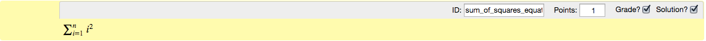
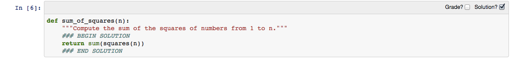

Developing assignments with the assignment toolbar
==================================================

**Note**: As you are developing your assignments, you should save them
into the ``source/{assignment_id}/`` folder of the nbgrader hierarchy,
where ``assignment_id`` is the name of the assignment you are creating
(e.g. "Problem Set 1").

.. seealso::

    :doc:`01_philosophy`
        More details on how the nbgrader hierarchy is structured.

Before you can begin developing assignments, you will need to actually
install the nbgrader toolbar. If you do not have it installed, please
first follow the instructions
`here <https://github.com/jupyter/nbgrader>`__. Once the toolbar has
been installed, you should see it in the drop down "Cell toolbar" menu:

.. figure:: images/select_assignment_toolbar.png
   :alt: 

Selecting the "Create Assignment" toolbar will create a separate toolbar
for each cell. By default, this consists of two checkboxes:

.. figure:: images/assignment_toolbar.png
   :alt: 

"Grade" cells
-------------

If you select the "Grade?" checkbox for a cell, it will mark that cell
as a "grader" cell. Grader cells are either code cells that will be run
by the autograder, or text cells that will be graded by hand by a human
grader. Regardless of cell type, all grader cells should have an id, and
a point value, which can be specified through the toolbar:

.. figure:: images/grader_cell.png
   :alt: 

Grader code cells should contain ``assert`` statements (or similar).
When run through the autograder, the cell will pass if no errors are
raised, and fail otherwise.

"Solution" cells
----------------

If you select the "Solution?" checkbox for a cell, it will mark that
cell as a "solution" cell. When creating the :doc:`release version <03_generating_assignments>` of
the assignment, the bodies of solution cells will be replaced with a code or
text stub indicating to the students that they should put their answer or
solution there.

Cells can be both grader and solution cells. This case arises with
written answers, for example, because the cell contains both the
solution to the problem, but still needs to be graded by hand by a human
grader:

Solutions can also be specified inline, through the use of a special
syntax such as ``### BEGIN SOLUTION`` and ``### END SOLUTION``. For
example:

When creating the :doc:`release version <03_generating_assignments>`, the region between
the special syntax lines will be replaced with the code or text stub.

Even if cells with the inline syntax are be marked as solution cells
with the checkbox, only the designated region will be replaced with the
stub, rather than the entire cell contents.

Writing Test Cases Documentation
--------------------------------

After assignments are submitted, you can run ``nbgrader autograde`` to automatically grade problems that have been marked to be autograded. Autograding requires the instructor to write his/her own test cases to check the solutions and therefore not all problems can be autograded.

For more documentation on autograding, click :doc:`here <04_autograding>`.

**Problems that can be autograded**

Most problems can be autograded. Problems that involve writing fruitful functions can be graded more easily than others. These types of problems can be graded by writing test functions that compare output values. Instructors should make sure that all edge cases are captured when creating test cases. Problems that require writing void functions are harder to autograde and may involve checking stdout, depending on the nature of the problem. Currently, the recommended approach to grading plots is to grade them manually.

**Tips for writing good test cases**

Test each function/feature in isolation. If a problem contains many functions or parts, write cases that test each of these functions individually. Testing one function at a time makes it easier for you to track an error. 

Organize test cases consistently. It can be helpful to arrange and group your test cases with comments.

Try to cover all edge cases. If you have a function that can take in a certain range of inputs, test the boundaries of this range. Test cases should also check for different lengths, different cases of strings, integers and floats, or different ranges when applicable.

**Example**

Problem: Write a function isAnagram() that takes 2 strings, and returns True if the two given strings are anagrams of each other. Your function should ignore cases, spaces, and all punctuation. So your function should identify ‘HeLLo!” and “hOlle” as anagrams.

Test cases:
::
 from nose.tools import assert_equal

 # standard True cases
 assert_equal(isAnagram(‘hi’,’hi’),True)
 assert_equal(isAnagram(‘pat’,’tap’’),True)
 assert_equal(isAnagram(‘left’,’felt’),True)

 # ignore punctuation, spaces, and different cases (upper/lower)
 assert_equal(isAnagram(‘hi’,’hi!’),True)
 assert_equal(isAnagram(‘HI’,’hi’),True)
 assert_equal(isAnagram(‘hi’,’HI’),True)
 assert_equal(isAnagram(‘He llo’,’?hello’),True)

 # False cases
 assert_equal(isAnagram(‘hi’,’h’),False)
 assert_equal(isAnagram(‘apple’,’aple’),False)
 assert_equal(isAnagram(‘aaaaaa’, ‘aaaa’), False)

**Partially autograding, partially manually grading**

When test cases are not enough to determine the correctness of a student’s solution, you can autograde them to make sure that there are no errors in the execution or the solution. You still need to manually look at the solutions to determine whether they are correct or not. This might be helpful if you want students to write a function for a problem using a specific implementation approach.

**Example**

Problem: Write a function sortList() that takes a list of numbers and returns a list sorted in descending order without using the built-in methods.

Test cases (but will still require instructors to check whether any built-in method is used):
::

 from nose.tools import assert_equal
 assert_equal(sortList(2,3,1),[3,2,1])
 assert_equal(sortList(3,2,1),[3,2,1])
 assert_equal(sortList(1,2,1,2,3,1),[3,2,2,1,1,1])
 assert_equal(sortList(-1,0,1),[1,0,-1])
