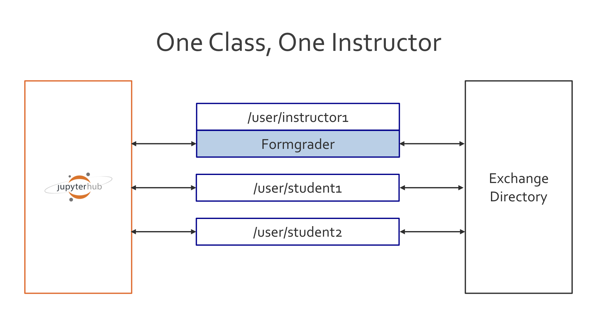
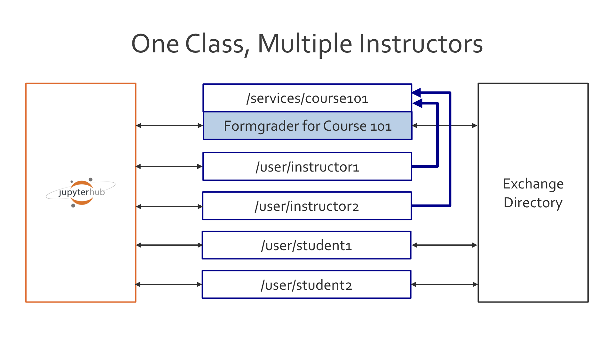
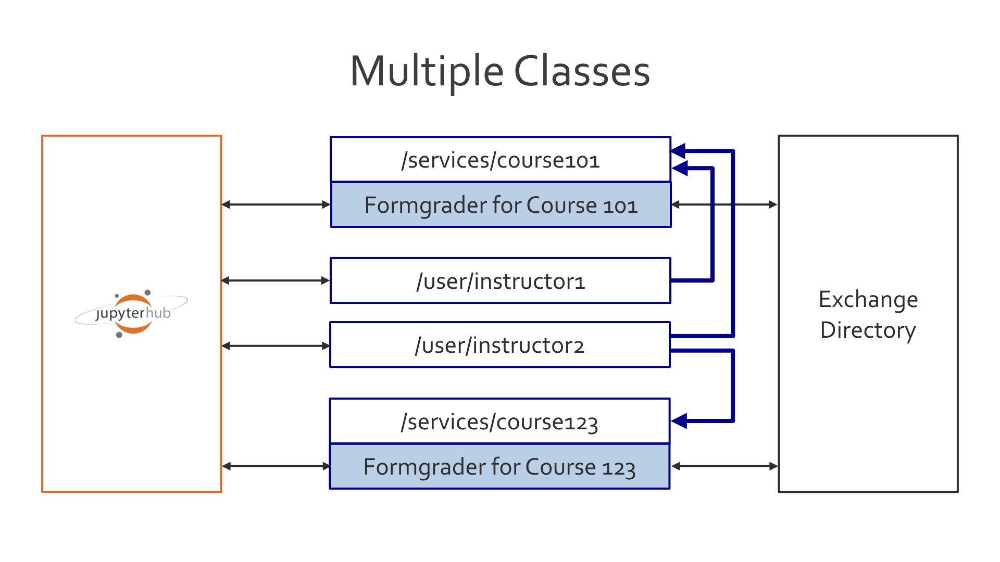

Using nbgrader with JupyterHub
==============================

.. seealso::

    :doc:`/user_guide/creating_and_grading_assignments`
        Documentation for ``nbgrader generate_assignment``, ``nbgrader autograde``, ``nbgrader formgrade``, and ``nbgrader generate_feedback``.

    :doc:`/user_guide/managing_assignment_files`
        Documentation for ``nbgrader release_assignment``, ``nbgrader fetch_assignment``, ``nbgrader submit``, and ``nbgrader collect``.

    :doc:`nbgrader_config`
        Details on how to setup the ``nbgrader_config.py`` file.

    :doc:`/user_guide/philosophy`
        More details on how the nbgrader hierarchy is structured.

    `JupyterHub Documentation <https://jupyterhub.readthedocs.io/en/latest/getting-started/index.html>`_
        Detailed documentation describing how JupyterHub works, which is very
        much required reading if you want to integrate the formgrader with
        JupyterHub.

For instructors running a class with JupyterHub, nbgrader offers several tools
that optimize and enrich the instructors' and students' experience of sharing
the same system. By integrating with JupyterHub, nbgrader streamlines the
process of releasing and collecting assignments for the instructor and of
fetching and submitting assignments for the student. In addition to using the
``nbgrader release_assignment``, ``nbgrader fetch_assignment``, ``nbgrader submit``, and ``nbgrader
collect`` commands (see :doc:`/user_guide/managing_assignment_files`) with a
shared server setup like JupyterHub, the formgrader (see
:doc:`/user_guide/creating_and_grading_assignments`) can be configured to
integrate with JupyterHub so that all grading can occur on the same server.

.. warning::

    When using nbgrader with JupyterHub, it is strongly recommended to set a
    logfile so that you can more easily debug problems. To do so, you can set
    a config option, for example ``NbGrader.logfile = "/usr/local/share/jupyter/nbgrader.log"``.

Each of these use cases also has a corresponding demo in the `demos folder <https://github.com/jupyter/nbgrader/tree/master/demos>`_ of the GitHub repository.

Example Use Case: One Class, One Grader
~~~~~~~~~~~~~~~~~~~~~~~~~~~~~~~~~~~~~~~

The formgrader should work out-of-the-box with JupyterHub if you only have a
single grader for your class: all you need to do is make sure that you have
installed and enabled the nbgrader extensions (see
:doc:`/user_guide/installation`) and then make sure the path to your course
directory is properly set in the instructor's ``nbgrader_config.py``. For
example, if the instructor account is called ``instructor`` and your course
directory is located in ``/home/instructor/course101/``, then you should have
a file at ``/home/instructor/.jupyter/nbgrader_config.py`` with contents like:

.. code:: python

    c = get_config()
    c.CourseDirectory.root = '/home/instructor/course101'

The following figure describes the relationship between the instructor account,
the student accounts, and the formgrader on JupterHub. In particular, note that
in this case the formgrader is running directly on the instructor's account:

.. _multiple-graders:

Example Use Case: One Class, Multiple Graders
~~~~~~~~~~~~~~~~~~~~~~~~~~~~~~~~~~~~~~~~~~~~~

If you have multiple graders, then you can set up a `shared notebook server
<https://github.com/jupyterhub/jupyterhub/tree/master/examples/service-notebook>`_
as a JupyterHub service. I recommend creating a separate grader account (such
as ``grader-course101``) for this server to have access to.

The following figure describes the relationship between the instructor
accounts, the student accounts, and the formgrader on JupterHub. In particular,
note that in this case the formgrader is running as a separate service, which each instructor then has access to:

You will additionally need to install and enable the various nbgrader extensions for different accounts (see
:doc:`/user_guide/installation`). This table should clarify which extension to enable when you have separate services for the formgraders.

.. list-table::
   :widths: 33 33 33 33
   :header-rows: 1

   * - 
     - Students
     - Instructors
     - Formgraders
   * - Create Assignment
     - no
     - no
     - yes
   * - Assignment List
     - yes
     - yes
     - no
   * - Formgrader
     - no
     - no
     - yes
   * - Course List
     - no
     - yes
     - no

Your JupyterHub should look something like this:

.. code:: python

    c = get_config()

    # Our user list
    c.Authenticator.whitelist = [
        'instructor1',
        'instructor2',
        'student1',
    ]

    # instructor1 and instructor2 have access to a shared server:
    c.JupyterHub.load_groups = {
        'formgrade-course101': [
            'instructor1',
            'instructor2'
        ]
    }

    # Start the notebook server as a service. The port can be whatever you want
    # and the group has to match the name of the group defined above. The name
    # of the service MUST match the name of your course.
    c.JupyterHub.services = [
        {
            'name': 'course101',
            'url': 'http://127.0.0.1:9999',
            'command': [
                'jupyterhub-singleuser',
                '--group=formgrade-course101',
                '--debug',
            ],
            'user': 'grader-course101',
            'cwd': '/home/grader-course101'
        }
    ]

Similarly to the use case with just a single grader, there needs to then be a ``nbgrader_config.py`` file in the root of the grader account, which points to the directory where the class files are, e.g. in ``/home/grader-course101/.jupyter/nbgrader_config.py``:

.. code:: python

    c = get_config()
    c.CourseDirectory.root = '/home/grader-course101/course101'

You will additionally need to add a global nbgrader config file (for example,
in ``/etc/jupyter/nbgrader_config.py``) which specifies the course id:

.. code:: python

    c = get_config()
    c.CourseDirectory.course_id = 'course101'

This course id MUST match the name of the service that is running the formgrader.

Example Use Case: Multiple Classes
~~~~~~~~~~~~~~~~~~~~~~~~~~~~~~~~~~

As in the case of multiple graders for a single class, if you have multiple
classes on the same JupyterHub instance, then you will need to create multiple
services (one for each course) and corresponding accounts for each service
(with the nbgrader extensions enabled, see :doc:`/user_guide/installation`).
For example, you could have users ``grader-course101`` and
``grader-course123`` which access services called ``course101`` and ``course123``, respectively.

The following figure describes the relationship between the instructor accounts
and the formgraders on JupterHub (student accounts are not shown, but are the
same as in :ref:`multiple-graders`). In particular, note that in
this case each formgrader is running as a separate service, which some
combination of instructors then have access to:

.. _jupyterhub-auth:

JupyterHub Authentication
^^^^^^^^^^^^^^^^^^^^^^^^^

.. versionadded:: 0.6.0

With the advent of JupyterHubAuthPlugin, nbgrader will ask JupyterHub which students are enrolled in which courses and only show them assignments from those respective courses (note that the ``JupyterHubAuthPlugin`` requires JupyterHub version 0.8 or higher). Similarly, nbgrader will ask JupyterHub which instructors have access to which courses and only show them formgrader links for those courses.

On the JupyterHub side of things, to differentiate student from instructor, groups need to be named ``formgrade-{course_id}`` for instructors and and grader accounts, and ``nbgrader-{course_id}`` for students. The course service additionally needs to have an API token set that is from a JupyterHub admin (see `JupyterHub documentation <https://jupyterhub.readthedocs.io/en/stable/reference/rest.html#create-an-api-token>`_).

As in the case of multiple graders for a single class, if you have multiple
classes on the same JupyterHub instance, then you will need to create multiple
services (one for each course) and corresponding accounts for each service
(with the nbgrader extensions enabled, see :doc:`/user_guide/installation`).
For example, you could have users ``grader-course101`` and
``grader-course123``. Your JupyterHub config would then look something like
this:

.. code:: python

    c = get_config()

    # Our user list
    c.Authenticator.whitelist = [
        'instructor1',
        'instructor2',
        'student1',
        'grader-course101',
        'grader-course123'
    ]

    c.Authenticator.admin_users = {
        'instructor1',
        'instructor2'
    }

    # instructor1 and instructor2 have access to different shared servers:
    c.JupyterHub.load_groups = {
        'formgrade-course101': [
            'instructor1',
            'grader-course101',
        ],
        'formgrade-course123': [
            'instructor2',
            'grader-course123'
        ],
        'nbgrader-course101': [],
        'nbgrader-course123': []
    }

    # Start the notebook server as a service. The port can be whatever you want
    # and the group has to match the name of the group defined above.
    c.JupyterHub.services = [
        {
            'name': 'course101',
            'url': 'http://127.0.0.1:9999',
            'command': [
                'jupyterhub-singleuser',
                '--group=formgrade-course101',
                '--debug',
            ],
            'user': 'grader-course101',
            'cwd': '/home/grader-course101',
            'api_token': ''  # include api token from admin user
        },
        {
            'name': 'course123',
            'url': 'http://127.0.0.1:9998',
            'command': [
                'jupyterhub-singleuser',
                '--group=formgrade-course123',
                '--debug',
            ],
            'user': 'grader-course123',
            'cwd': '/home/grader-course123',
            'api_token': ''  # include api token from admin user
        },
    ]

Note: As you can see the ``nbgrader-{course_id}`` group is an empty list.
Adding students to the JupyterHub group is automatically done when the
instructor adds them to the course database with the ``nbgrader db student
add`` command or through the formgrader.

On the nbgrader side of things, activating the JupyterHubAuthPlugin requires
you to add it as an authentication plugin class into the ``nbgrader_config.py``
for all accounts. This is easiest to do by putting it in a global location such
as ``/etc/jupyter/nbgrader_config.py``. You also need to configure nbgrader to
look for assignments in a subdirectory corresponding to the course name (see
:ref:`multiple-classes`). For example:

.. code:: python

    from nbgrader.auth import JupyterHubAuthPlugin
    c = get_config()
    c.Exchange.path_includes_course = True
    c.Authenticator.plugin_class = JupyterHubAuthPlugin

There also needs to be a separate ``nbgrader_config.py`` file in the root of
each grader account, which points to the directory where the class files are
and which specifies what the course id is, e.g.
``/home/grader-course101/.jupyter/nbgrader_config.py`` would be:

.. code:: python

    c = get_config()
    c.CourseDirectory.root = '/home/grader-course101/course101'
    c.CourseDirectory.course_id = 'course101'

and ``/home/grader-course123/.jupyter/nbgrader_config.py`` would be:

.. code:: python

    c = get_config()
    c.CourseDirectory.root = '/home/grader-course123/course123'
    c.CourseDirectory.course_id = 'course123'

Finally, you will again need to enable and disable different combinations of
the nbgrader extensions for different accounts. See the table in
:ref:`multiple-graders` for details.

Custom Authentication
^^^^^^^^^^^^^^^^^^^^^

.. versionadded:: 0.6.0

To make your own custom authentication such as through an LTI you could start by making a method that inherits the Authenticator class, which is a plugin for different authentication methods.

There are now four authentication classes:

* ``BaseAuthPlugin``: Inherit this class when implementing your own plugin, thought of as a way to enable LTI use cases. This class is never called directly.
* ``NoAuthPlugin``: The default old behaviour. Using this plugin will allow any user to any course if they do not have a course_id in their nbgrader_config. This is still the default behaviour so no need to specify it in ``/etc/jupyter/nbgrader_config.py``
* ``JupyterHubAuthPlugin``: Uses the Jupyterhub groups part of the JupyterHub API for authentication.
* ``Authenticator``: Configurable for different plugins.

API
---

.. currentmodule:: nbgrader.auth

.. autoclass:: BaseAuthPlugin

    .. automethod:: get_student_courses

    .. automethod:: add_student_to_course

    .. automethod:: remove_student_from_course
