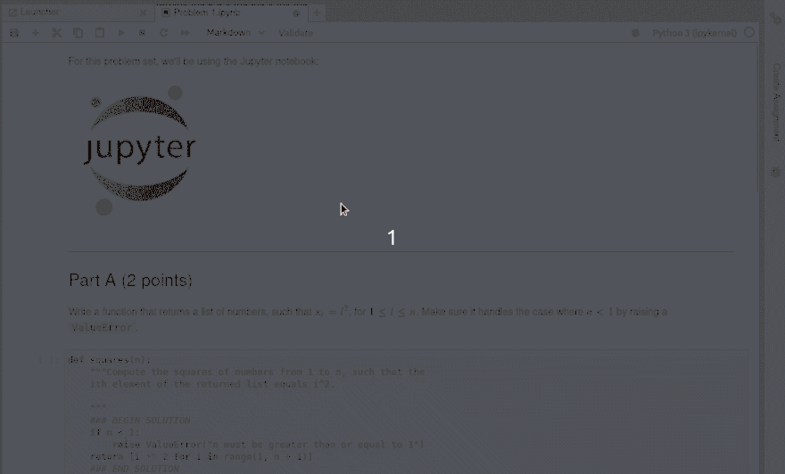
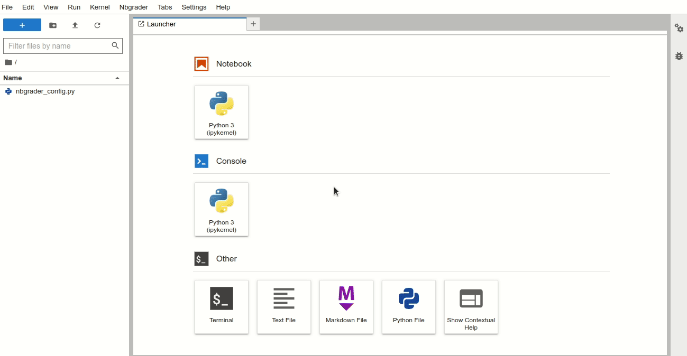

Interface highlights
====================

Instructor toolbar extension for Jupyter notebooks
--------------------------------------------------

The **nbgrader toolbar extension** for Jupyter notebooks guides the instructor
through assignment and grading tasks using the familiar Jupyter notebook
interface. For example, creating an assignment has the following workflow:

Instructor "formgrader" extension for Jupyter notebooks
-------------------------------------------------------

The **formgrader extension** for the Jupyter notebook allows instructors to use
the core functionality of nbgrader---generating the student version of an
assignment, releasing assignments to students, collecting assignments,
autograding submissions, and manually grading submissions.

.. image:: images/formgrader.gif
    :alt: Formgrader extension

Student assignment list extension for Jupyter notebooks
-------------------------------------------------------

Using the **assignment list extension**, students may conveniently view, fetch,
submit, and validate their assignments. This is also where they recieve and
review any feedback on those submissions:

The command line tools of nbgrader
----------------------------------

The **command line tools** offer an efficient way for the instructor to
generate, assign, release, collect, and grade notebooks. Here are some of the
commands:

* `nbgrader assign`: create a student version of a notebook
* `nbgrader release`: release a notebook to students
* `nbgrader collect`: collect students' submissions
* `nbgrader autograde`: autograde students' submissions
* `nbgrader generate_feedback`: create feedback files from graded submissions
* `nbgrader release_feedback`: release the feeback files to students

The **command line** also offers students a way of working with notebooks:

* `nbgrader fetch`: gets a released notebook
* `nbgrader submit`: deposit a notebook for grading/review
* `nbgrader fetch_feedback`: get any feeback for a submission
